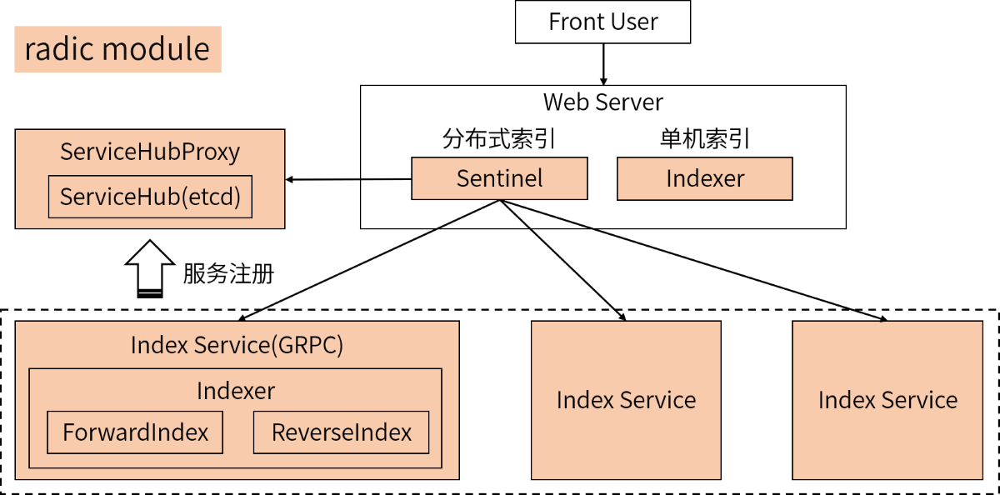

# radic索引框架
radic，纯go语言实现的搜索引擎索引框架。目前是v2版本。    
## 倒排索引

    

- 倒排索引的list是有序的，便于多条倒排链快速求交集。    
- IntId是radic系统内部给doc生成的自增id，用于SkipList的排序。  
- Id是doc在业务侧的ID。   
- BitsFeature是uint64，可以把doc的属性编码成bit流，遍历倒排索引的同时完成部分筛选功能。  

## 正排索引
支持badger和bolt两种数据库存储doc的详情。  

## 分布式索引
doc数量过大，单机容不下时，可以将doc分散存储在多台服务器上。各索引服务器之间通过grpc通信，通过etcd实现服务注册与发现。  

    

- 由多个Group垂直切分整个倒排索引，每个Group内有多台worker做冗余备份
- Group内部使用最小并发度算法做负载均衡
- worker(Group)之间通过etcd感知彼此的存在，并使用grpc通信
- request先打到etcd，etcd对各个Group做负载均衡
- proxy缓存etcd的结果，并对etcd进行限流保护  

## radic搜索引擎架构
   

## 使用方法
`go get -u github.com/Orisun/radic/v2`
假设业务doc为Book
```go 
type Book struct {
	ISBN    string
	Title   string
	Author  string
	Price   float64
	Content string
}
// 业务侧自行实现doc的序列化和反序列化
func (book *Book) Serialize() []byte {
}
func DeserializeBook(v []byte) *Book {
}
```
初始化radic  
```go
dbType := types.BADGER   //或types.BOLT
dbPath := "data/local_db/book_badger"   //正排索引的存储路径
docNum := 10000    //预估索引里将存储多少文档
radic := new(index_service.Indexer)
if err := radic.Init(docNum, dbType, dbPath); err != nil {
    panic(err)
}
defer radic.Close()
```
添加doc  
```go
book := Book{}
doc := types.Document{
		Id:          book.ISBN,
		BitsFeature: 0b10011, //二进制
		Keywords:    []*types.Keyword{{Field: "content", Word: "唐朝"}, {Field: "content", Word: "文物"}, {Field: "title", Word: book.Title}},
		Bytes:       book.Serialize(),
	}
radic.AddDoc(doc)
```
删除doc  
```go 
radic.DeleteDoc(doc.Id)
```
检索  
```go 
q1 := types.NewTermQuery("title", "生命起源")
q2 := types.NewTermQuery("content", "文物")
q3 := types.NewTermQuery("title", "中国历史")
q4 := types.NewTermQuery("content", "文物")
q5 := types.NewTermQuery("content", "唐朝")

// 支持任意复杂的And和Or的组合。And要求同时命中，Or只要求命中一个
query := (q1.Or(q2)).And((q3.Or(q4)).And(q5))
var onFlag uint64 = 0b10000    //要求doc.BitsFeature的对应位必须都是1
var offFlag uint64 = 0b01000    //要求doc.BitsFeature的对应位必须都是0
orFlags := []uint64{uint64(0b00010), uint64(0b00101)}    //要求doc.BitsFeature的对应位至少有一个是1
docs := radic.Search(query, onFlag, offFlag, orFlags) //检索
for _, doc := range docs {
    book := DeserializeBook(doc.Bytes) //检索的结果是二进流，需要自反序列化
    if book != nil {
        fmt.Printf("%s %s %s %.1f\n", book.ISBN, book.Title, book.Author, book.Price)
    }
}
```

  